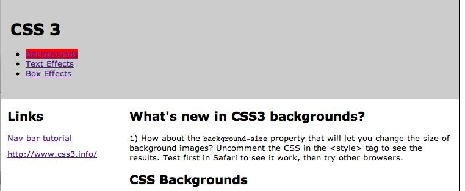
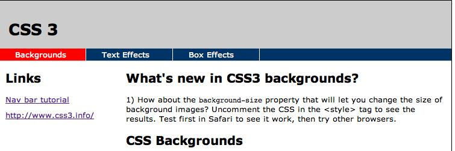
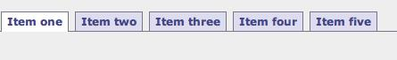

# Exercise: Stylish Navigation
## Part A - Use styles to create a navigation bar in the provided files

We're trying to go from this:

to this:

***Do this by changing only the CSS, not the HTML.***

|Note|
|:----|
|You may find it interesting to look at the content of the pages provided.  The pages use some of the new features of HTML5 and CSS-3|

### Instructions
1. Download the [startup files provided here](stylish-nav-start.zip).
2. Read and complete the tutorial at: http://css.maxdesign.com.au/floatutorial/tutorial0601.htm

|Note|
|:----|
|To do this, you will only modify the **styles.css** file; ***do not*** alter the HTML in the other documents.|

3. You will have to make your buttons a little wider to fit the text.  Try changing the width property of the "**ul#navlist li a**" rule to be a little wider than 5em.
4. Save the files for this part; you’ll submit them at the end.

## Part B - Create a Tab Bar navigation system for your project 

|Note|
|:----|
|You are *not* required to use this navigation system in the final version of your project.|

The following brief tutorials show you how to create a tab bar navigation system from an unordered list.  To do so, you’ll be reviewing the following tutorials online:
- http://css.maxdesign.com.au/listamatic/horizontal01.htm
- http://css.maxdesign.com.au/listamatic/horizontal02.htm
- http://css.maxdesign.com.au/listamatic/horizontal03.htm
- http://css.maxdesign.com.au/listamatic/horizontal05.htm

### Instructions

1. Complete the tutorials, and re-create lists 1, 2, 3 and 5 that are linked above in 4 separate web pages. Replace "Item 1", "Item 2", etc., with category names related to your project or interests.  (In other words, you will create four pages with identical content, as placeholders.  Each page will display a different variation on the "tab" metaphor.)  *Do Not* use Item 1, Item 2, etc., as shown in the example above.
2. As in Part A, save these files for submission.

|Note|
|:----|
|The maxdesign web site we are using in this exercise is an excellent resource.  Go to http://css.maxdesign.com.au for more information.|

## Part C - Add CSS transitions

For this part, make a copy of the *last* page you made in Part B. Refer to our demo from class (the finished files will be posted for your reference, but you’ll also need to work through the problem of applying the techniques to this specific instance). In this file, do the following:

1. Place all your nav items into a single vertical menu, rather than horizontal tabs.
2. Add a menu heading of some sort at the top of this list.
      1. This item will be a dropdown menu with the rest of your nav under it, all contained in a single div. As with the previous parts of this exercise, each of these nav items should be a link, but they don’t need to actually go anywhere.
      2. In your CSS, use a class to give this div the following properties:
          - A background color that matches the rest of your navigation
          - A height of 1 em
          - A width of 200px (or some other value that will universally fit whatever content you have in it)
          - Set its "overflow" property to "hidden"
          - Style the div further to look pretty, and have good fonts and text colors.
      3. When you hover over the div, set its height to be some value that lets you see all the items (a good rule of thumb is to count your lines in the div, so that would be your number of ICEs plus the "heading", and then set the div to that many **em**).
      4. Set a transition for the class, so that when its height is changed it takes 1 second.

## Submission
Zip all the files from this exercise, clearly named and organized, into a single zip file and post it to the myCourses dropbox by the due date.
